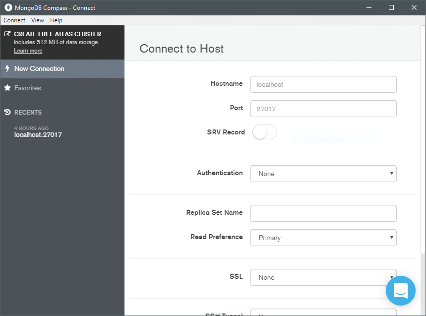
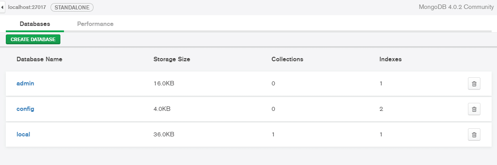

# Docker-Compose MongoDB

Esse repositório se destina a guardar os meu arquivos docker-compose.

## Como executar

Para subir qualquer um dos serviços abaixo basta apenas entrar no diretório onde se encontra o arquivo "docker-compose.yml" e executar o comando abaixo.

``` bash
docker-compose up -d
```

Para parar a execução do serviço basta apenas executar o comando abaixo dentro da pasta onde se encontra o arquivo docker-compose.yml.

``` bash
docker-compose down
```

## MongoDB

O diretório mongodb guarda o compose que sobe uma instância do banco de dados MongoDB.

Para melhor interação com o banco baixe e instale o client MongoDB Compass através do [link](https://www.mongodb.com/try/download/compass).



Após baixar basta configurar `` `Hostname: localhost, e Port: 27017` `` para conectar o compass ao banco.

Após conectado será exibida a seguinte tela.



Para parar a execução do serviço basta apenas executar o comando abaixo dentro da pasta onde se encontra o arquivo docker-compose.yml.

## MySQL

O diretório mysql-phpmyadmin guarda o compose que sobe uma instância do banco de dados mysql juntamente com o phpmyadmin.

## PostgreSQL

O diretório postgres-pgadmin guarda o compose que sobe uma instância do banco de dados PostgeSQL juntamente com o pgadmin.
